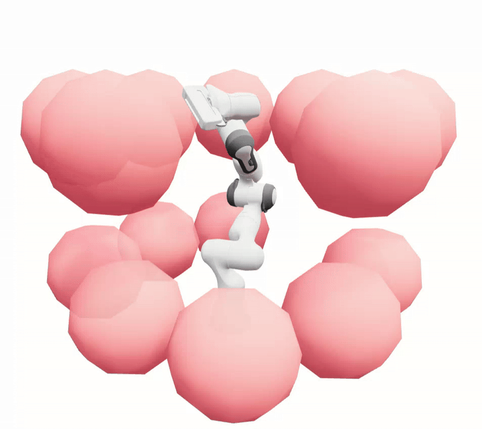

# OMPL.JAX
⚠️ Hey there! The project is still under construction...

Solve motion planning problems in python in millisecond!

## TODO
- [ ] Clearer README
- [ ] Pre-release OMPL nanobind
- [ ] Improve robot self-collision checking accuracy (a problem originating from pyroki)
- [ ] Implement path simplification 
- [ ] Add support for kinodynamic paths
- [ ] Add support for constraint projections

# Acknowledgements
This project is inspired by:
- OMPL: https://ompl.kavrakilab.org/
- Pyroki: https://github.com/chungmin99/pyroki
